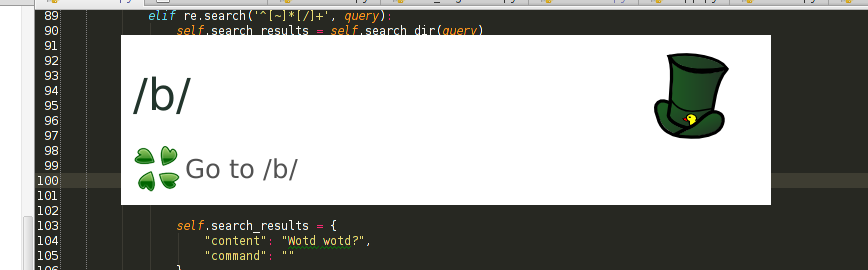

# Ducked

App launcher with a decent plugin system, able to bring apps to the foreground if it's already open.

Supports web search for:

- Google
- Youtube
- Wiki
- 4chan
- Github
- Google Maps
- Gmail
- Torrentz
- Python 2 & 3
- PHP
- Twitter

It also:

- acts as a calculator
- allows you to browse to websites immediately by entering a URL
- has a plugin system, to extend web searches, and to run your own commands, extending functionalities as you see fit.
- Lets you jump to directories (or open files)
- Choose to bring to front or launch anew (press enter == bring to front if possible, ctrl+enter == open new app).

## Essentials
Python, GTK, bash, sqlite, kittens.

## screenshots

### Goto apps

### Calculate stuff

### Jump to dirs

### Search for Piratables

### The Chans

## dependencies

python

    pygtk

shell

    xdotool
    wmctrl
    
    
## Installation on Ubuntu

### dependencies
sudo pip install pygtk python-levenshtein fuzzywuzzy

sudo apt-get install xdotool wmctrl

### install app (directly from master)
cd /usr/share

git clone https://github.com/wisc/ducked.git

ln -s /usr/share/ducked/ducked.py /usr/local/bin/ducked

### Launch

$ ducked

This command can be used to attach a global shortcut. The first time it'll index all installed apps, so it might take
 a few seconds to start.