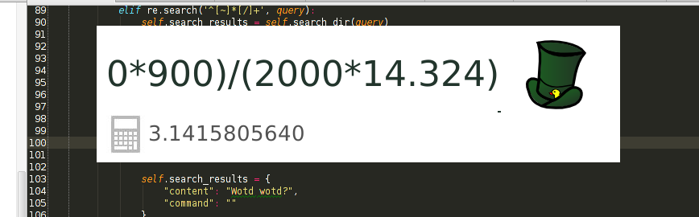

# Ducked

App launcher that doesn't aim for being Ultra Shitty. Python, GTK, bash, sqlite, kittens.

Supports basic search for:

    Google
    Youtube
    Wiki
    4chan
    Github
    Google Maps
    Gmail
    Torrentz
    Python 2 & 3
    PHP
    Twitter

## screenshots

### Goto apps

### Calculate stuff

### Jump to dirs

### Search for Piratables

### The Chans

## dependencies

python

    pygtk
    https://github.com/seatgeek/fuzzywuzzy
    python-levenshtein

shell

    xdotool
    wmctrl
    
    
## Installation on Ubuntu

### dependencies
sudo pip install pygtk python-levenshtein fuzzywuzzy

sudo apt-get install xdotool wmctrl

### install app (directly from master)
cd /usr/share

git clone https://github.com/wisc/ducked.git

### Launch

python /usr/share/ducked/ducked.py

This command can be used to attach a global shortcut. The first time it'll index all installed apps, so it might take
 a few seconds to start.